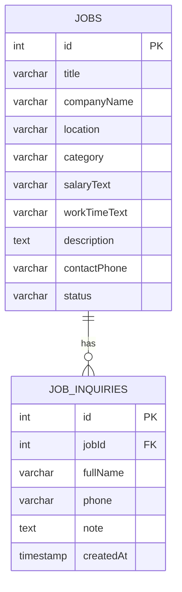

# Báo cáo tiêu chí chấm — FindSeasonalJobApp (Frontend + Backend)

## 1) Tổng quan đề tài
**Mục tiêu**: Ứng dụng tìm việc thời vụ (part-time/seasonal) gồm:
- Frontend (Expo/React Native): hiển thị danh sách việc, tìm kiếm/lọc, xem chi tiết, lưu yêu thích, gửi đăng ký quan tâm.
- Backend (Node.js/Express) + MySQL: cung cấp API CRUD cho dữ liệu việc làm và module đăng ký quan tâm.

## 2) Phân tích module (từ yêu cầu + UI)
1) **Module Việc làm (Jobs)**
- Danh sách việc
- Xem chi tiết việc
- CRUD việc làm (phục vụ quản trị/nhập dữ liệu, Postman test)

2) **Module Đăng ký quan tâm (Job inquiries)**
- Người dùng nhập Họ tên + SĐT + ghi chú
- Gửi thông tin quan tâm theo từng job

3) **Module Yêu thích (Favorites)**
- Lưu/huỷ lưu yêu thích ngay trên UI (client-side)

4) **Navigation**
- Điều hướng giữa Home (danh sách) ↔ JobDetail (chi tiết) bằng React Navigation (Stack).

## 3) Phân tích CSDL (MySQL)
### 3.1 ERD (mô hình quan hệ)

### 3.2 Bảng `jobs`
**Vai trò**: Lưu thông tin việc làm hiển thị trên app.
- `id`: khoá chính (INT AUTO_INCREMENT)
- Các cột còn lại phản ánh đúng UI (title, companyName, location, category, salaryText, workTimeText, description, contactPhone, status)

**Lý do thiết kế**:
- Dùng kiểu `VARCHAR/TEXT` để linh hoạt nhập dữ liệu.
- `status` mặc định `open`.

### 3.3 Bảng `job_inquiries`
**Vai trò**: Lưu đăng ký quan tâm theo từng job.
- `id`: khoá chính
- `jobId`: khoá ngoại tham chiếu `jobs(id)`
- `createdAt`: mặc định thời điểm tạo
- **Ràng buộc**: `ON DELETE CASCADE` để xoá job thì xoá luôn inquiry liên quan.

### 3.4 Dữ liệu seed
- Khi database rỗng, hệ thống seed sẵn 3 job mẫu để frontend có dữ liệu ngay.

## 4) Thiết kế & xây dựng API cơ bản (Node.js + Express)
**Base URL**:
- HTTPS: `https://localhost:4953`
- HTTP fallback (dev/Expo Go): `http://localhost:4952`

### 4.1 Jobs API (CRUD)
- `GET /jobs` → lấy toàn bộ jobs
- `GET /jobs?title=...` → search theo tiêu đề (partial match)
- `GET /jobs/:id` → lấy 1 job theo id
- `POST /jobs` → tạo job (lưu vào MySQL)
- `PUT /jobs/:id` → cập nhật job
- `DELETE /jobs/:id` → xoá job

**Status code chính**:
- `200` OK (GET/PUT)
- `201` Created (POST)
- `200` OK (DELETE, trả JSON message)
- `400` Validation error
- `404` Not found

### 4.2 Job inquiries API
- `POST /jobs/:id/inquiries` → tạo đăng ký quan tâm cho job
- (tuỳ chọn quản trị) `GET /inquiries`, `GET /inquiries/:id`, `PUT /inquiries/:id`, `DELETE /inquiries/:id`
- (tuỳ chọn) `GET /jobs/:id/inquiries` → xem inquiry theo job

## 5) Frontend: tính năng/giao diện + Navigation
### 5.1 Tính năng/giao diện
- Home: danh sách việc + search theo từ khoá
- Lọc theo khu vực (location) và lĩnh vực (category)
- Job detail: xem thông tin chi tiết + form đăng ký quan tâm
- Yêu thích: toggle sao (★/☆)

### 5.2 Navigation
- Dùng **React Navigation (Stack)** để điều hướng Home ↔ JobDetail.

## 6) Cách chạy & demo với Postman
### 6.1 Backend
- `cd backend`
- Tạo `backend/.env` (copy từ `.env.example`), chỉnh `DB_PASSWORD`...
- `npm install`
- `npm run dev`

### 6.2 Frontend
- `cd frontend`
- `npm install`
- `npm start`

### 6.3 Demo tiêu chí “Postman thay đổi backend → frontend hoạt động”
- Dùng Postman `POST /jobs` thêm job mới → reload app/Home sẽ thấy xuất hiện.
- Dùng Postman `PUT /jobs/:id` sửa thông tin → reload sẽ cập nhật.
- Dùng Postman `DELETE /jobs/:id` → job biến mất.

### 6.4 Demo tiêu chí “frontend → backend lưu MySQL”
- Trên JobDetail, nhập form “Đăng ký quan tâm” và bấm gửi → backend lưu vào bảng `job_inquiries`.
