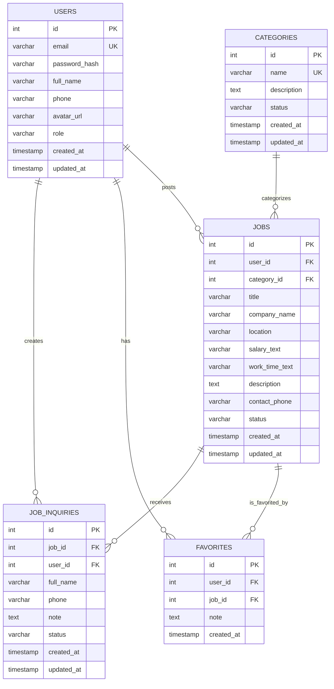

# BÁO CÁO TỔNG HỢP - FindSeasonalJobApp

**Ngày**: 2026-06-16  
**Dự án**: Ứng dụng tìm việc thời vụ (Seasonal Job Finding Application)

---

## I. TỔNG QUAN DỰ ÁN

### 1.1 Mục tiêu
Xây dựng ứng dụng di động giúp người dùng tìm kiếm và quản lý công việc thời vụ (part-time/seasonal) một cách hiệu quả. Ứng dụng hỗ trợ:
- Duyệt danh sách công việc
- Tìm kiếm và lọc theo tiêu chí
- Xem chi tiết công việc
- Lưu công việc yêu thích
- Gửi đơn đăng ký quan tâm
- Quản lý tài khoản người dùng
- Quản lý danh mục ngành nghề

### 1.2 Kiến trúc chung
```
FindSeasonalJobApp
├── Frontend: React Native (Expo)
│   ├── Navigation (React Navigation)
│   ├── Redux (State Management)
│   ├── Components & Screens
│   └── API Integration
│
└── Backend: Node.js (Express.js)
    ├── API Endpoints (CRUD)
    ├── Database: MySQL
    ├── Repositories (Business Logic)
    └── Validation
```

### 1.3 Công nghệ sử dụng

**Frontend:**
- React Native (v0.81.5)
- Expo (~54.0.35)
- React Navigation v7 (Stack & Tab Navigation)
- Redux Toolkit v2 + Redux Persist (State Management)
- AsyncStorage (Local Data Persistence)
- Expo Fonts, Vector Icons
- Expo Image Picker

**Backend:**
- Node.js
- Express.js v4.21.2
- MySQL (mysql2 v3.14.2)
- CORS v2.8.5
- dotenv v16.6.1
- Self-signed HTTPS (selfsigned v2.4.1)

---

## II. CẤU TRÚC DỮ LIỆU (DATABASE)

### 2.1 Sơ đồ Entity-Relationship (ERD)



### 2.2 Chi tiết các bảng

#### **Bảng `users` (Người dùng)**
| Cột | Kiểu dữ liệu | Mô tả |
|-----|---|---|
| `id` | INT AUTO_INCREMENT | Khóa chính |
| `email` | VARCHAR(100) UNIQUE | Email đăng nhập |
| `password_hash` | VARCHAR(255) | Mật khẩu (đã mã hóa) |
| `full_name` | VARCHAR(100) | Tên đầy đủ |
| `phone` | VARCHAR(20) | Số điện thoại |
| `avatar_url` | VARCHAR(500) | URL ảnh đại diện |
| `role` | ENUM('user', 'employer', 'admin') | Vai trò người dùng |
| `created_at` | TIMESTAMP DEFAULT CURRENT_TIMESTAMP | Thời gian tạo |
| `updated_at` | TIMESTAMP | Thời gian cập nhật |

#### **Bảng `jobs` (Công việc)**
| Cột | Kiểu dữ liệu | Mô tả |
|-----|---|---|
| `id` | INT AUTO_INCREMENT | Khóa chính |
| `user_id` | INT NOT NULL FK | ID chủ tuyển đăng tin |
| `category_id` | INT FK | ID danh mục |
| `title` | VARCHAR(200) | Tên vị trí tuyển dụng |
| `company_name` | VARCHAR(150) | Tên công ty |
| `location` | VARCHAR(150) | Địa điểm làm việc |
| `salary_text` | VARCHAR(100) | Mức lương (miêu tả) |
| `work_time_text` | VARCHAR(100) | Thời gian làm (miêu tả) |
| `description` | LONGTEXT | Mô tả chi tiết |
| `contact_phone` | VARCHAR(20) | SĐT liên hệ |
| `status` | ENUM('open', 'closed', 'draft') DEFAULT 'open' | Trạng thái |
| `created_at` | TIMESTAMP | Thời gian tạo |
| `updated_at` | TIMESTAMP | Thời gian cập nhật |

#### **Bảng `job_inquiries` (Đăng ký quan tâm)**
| Cột | Kiểu dữ liệu | Mô tả |
|-----|---|---|
| `id` | INT AUTO_INCREMENT | Khóa chính |
| `job_id` | INT NOT NULL FK | ID công việc |
| `user_id` | INT NOT NULL FK | ID người nộp đơn |
| `full_name` | VARCHAR(100) | Họ tên ứng viên |
| `phone` | VARCHAR(20) | SĐT ứng viên |
| `note` | TEXT | Ghi chú thêm |
| `status` | ENUM('pending', 'accepted', 'rejected') DEFAULT 'pending' | Trạng thái đơn |
| `created_at` | TIMESTAMP | Thời gian tạo |
| `updated_at` | TIMESTAMP | Thời gian cập nhật |
| **Constraint** | CASCADE | Xóa job → xóa inquiries |

#### **Bảng `favorites` (Công việc yêu thích)**
| Cột | Kiểu dữ liệu | Mô tả |
|-----|---|---|
| `id` | INT AUTO_INCREMENT | Khóa chính |
| `user_id` | INT NOT NULL FK | ID người dùng |
| `job_id` | INT NOT NULL FK | ID công việc |
| `note` | TEXT | Ghi chú cá nhân |
| `created_at` | TIMESTAMP | Thời gian lưu |
| **Constraint** | UNIQUE (user_id, job_id) | Mỗi user lưu 1 job 1 lần |

#### **Bảng `categories` (Danh mục ngành nghề)**
| Cột | Kiểu dữ liệu | Mô tả |
|-----|---|---|
| `id` | INT AUTO_INCREMENT | Khóa chính |
| `name` | VARCHAR(100) UNIQUE | Tên danh mục (F&B, Giao hàng, ...) |
| `description` | TEXT | Mô tả chi tiết |
| `status` | ENUM('active', 'inactive') DEFAULT 'active' | Trạng thái |
| `created_at` | TIMESTAMP | Thời gian tạo |
| `updated_at` | TIMESTAMP | Thời gian cập nhật |

### 2.3 Dữ liệu seed
- Khi database rỗng, hệ thống tự động seed:
  - **3 job mẫu** (để frontend có dữ liệu hiển thị ngay)
  - **5-10 category mẫu** (F&B, Giao hàng, Bán lẻ, ...)

---

## III. BACKEND - API & BUSINESS LOGIC

### 3.1 Thông tin kết nối

**HTTPS (chính):**
- URL: `https://localhost:4953`
- Port: 4953
- Certificate: Self-signed (dev)

**HTTP (fallback, Expo Go):**
- URL: `http://localhost:4952`
- Port: 4952

**Cấu hình:**
- Đọc từ `backend/.env`
- DB_USER, DB_PASSWORD, DB_HOST, DB_PORT, DB_NAME cần chỉnh sửa

### 3.2 Jobs API

#### **GET /jobs** - Lấy danh sách công việc
```http
GET /jobs
GET /jobs?title=keyword  # Search theo tiêu đề
```
**Response (200):**
```json
[
  {
    "id": 1,
    "title": "Nhân viên bán hàng",
    "companyName": "Công ty X",
    "location": "TP. HCM",
    "category": "Bán lẻ",
    "salaryText": "3-5 triệu",
    "workTimeText": "Part-time",
    "description": "...",
    "contactPhone": "0123456789",
    "status": "open"
  }
]
```

#### **GET /jobs/:id** - Lấy chi tiết 1 công việc
```http
GET /jobs/1
```
**Response (200):** Job object (như trên)

#### **POST /jobs** - Tạo công việc mới
```http
POST /jobs
Content-Type: application/json

{
  "title": "Giao hàng",
  "companyName": "Grab Vietnam",
  "location": "Hà Nội",
  "category": "Giao hàng",
  "salaryText": "4-6 triệu",
  "workTimeText": "Full-time",
  "description": "Giao hàng quận 1, 3, 4...",
  "contactPhone": "0987654321"
}
```
**Response (201):** Created job object

#### **PUT /jobs/:id** - Cập nhật công việc
```http
PUT /jobs/1
Content-Type: application/json

{
  "title": "Giao hàng (cập nhật)",
  "status": "closed"
}
```
**Response (200):** Updated job object

#### **DELETE /jobs/:id** - Xóa công việc
```http
DELETE /jobs/1
```
**Response (200):**
```json
{
  "message": "Công việc đã được xóa"
}
```

**Status Codes:**
- `200` OK
- `201` Created
- `400` Validation Error
- `404` Not Found
- `500` Server Error

### 3.3 Job Inquiries API

#### **POST /jobs/:id/inquiries** - Gửi đơn đăng ký
```http
POST /jobs/1/inquiries
Content-Type: application/json

{
  "fullName": "Nguyễn Văn A",
  "phone": "0912345678",
  "note": "Em rất muốn làm công việc này"
}
```
**Response (201):** Inquiry object

#### **GET /jobs/:id/inquiries** - Xem đơn đăng ký theo job
```http
GET /jobs/1/inquiries
Header: x-user-id: 1  # Chủ tuyển xem đơn của mình
```

#### **GET /inquiries** - (Admin) Xem tất cả đơn
```http
GET /inquiries
```

#### **GET /inquiries/:id** - Xem chi tiết 1 đơn
```http
GET /inquiries/5
```

#### **PUT /inquiries/:id** - Cập nhật trạng thái đơn
```http
PUT /inquiries/5
Content-Type: application/json

{
  "status": "accepted"  # hoặc 'rejected', 'pending'
}
```

#### **DELETE /inquiries/:id** - Xóa đơn
```http
DELETE /inquiries/5
```

### 3.4 Categories API

#### **GET /categories** - Lấy danh sách danh mục
```http
GET /categories
```
**Response (200):**
```json
[
  {
    "id": 1,
    "name": "F&B",
    "description": "Nhà hàng, quán ăn, cafe",
    "status": "active"
  },
  {
    "id": 2,
    "name": "Giao hàng",
    "description": "Giao hàng, vận chuyển",
    "status": "active"
  }
]
```

#### **POST /categories** - Tạo danh mục
```http
POST /categories
Content-Type: application/json

{
  "name": "Lao động phổ thông",
  "description": "Các công việc không yêu cầu bằng cấp",
  "status": "active"
}
```

#### **PUT /categories/:id** - Cập nhật danh mục
```http
PUT /categories/1
Content-Type: application/json

{
  "status": "inactive"
}
```

#### **DELETE /categories/:id** - Xóa danh mục
```http
DELETE /categories/1
```

### 3.5 Favorites API

#### **GET /favorites** - Xem danh sách yêu thích
```http
GET /favorites
Header: x-user-id: 1
```
**Response (200):**
```json
[
  {
    "id": 3,
    "jobId": 5,
    "userId": 1,
    "note": "Lương cao, cần ứng tuyển ngay",
    "createdAt": "2026-06-15T10:30:00Z"
  }
]
```

#### **POST /favorites** - Lưu công việc
```http
POST /favorites
Header: x-user-id: 1
Content-Type: application/json

{
  "jobId": 5,
  "note": "Lương cao, cần ứng tuyển ngay"
}
```

#### **PUT /favorites/:id** - Sửa ghi chú
```http
PUT /favorites/3
Content-Type: application/json

{
  "note": "Đã gọi điện hỏi thông tin"
}
```

#### **DELETE /favorites/:id** - Xóa khỏi yêu thích
```http
DELETE /favorites/3
```

### 3.6 Users API (Xác thực & Quản lý)

#### **POST /login** - Đăng nhập
```http
POST /login
Content-Type: application/json

{
  "email": "user@example.com",
  "password": "password123"
}
```
**Response (200):**
```json
{
  "user": {
    "id": 1,
    "email": "user@example.com",
    "fullName": "Nguyễn Văn A",
    "phone": "0912345678",
    "role": "user"
  }
}
```

#### **POST /register** - Đăng ký tài khoản
```http
POST /register
Content-Type: application/json

{
  "email": "newuser@example.com",
  "password": "password123",
  "fullName": "Nguyễn Văn B",
  "phone": "0987654321",
  "role": "user"
}
```

#### **GET /users/:id** - Lấy thông tin user
```http
GET /users/1
```

#### **PUT /users/:id** - Cập nhật thông tin user
```http
PUT /users/1
Content-Type: application/json

{
  "fullName": "Nguyễn Văn A (update)",
  "phone": "0912345679"
}
```

#### **GET /users/:userId/jobs** - Xem công việc đã đăng
```http
GET /users/1/jobs
```

### 3.7 Cấu trúc Backend Files

```
backend/
├── src/
│   ├── server.js                 # Entry point, route handlers
│   ├── db.js                     # MySQL connection pool
│   ├── jobsRepo.js               # Jobs CRUD operations
│   ├── inquiriesRepo.js          # Job Inquiries CRUD
│   ├── favoritesRepo.js          # Favorites CRUD
│   ├── categoriesRepo.js         # Categories CRUD
│   ├── usersRepo.js              # Users CRUD
│   ├── validateJob.js            # Job data validation
│   ├── validateInquiry.js        # Inquiry validation
│   └── validateUser.js           # User validation
├── sql/
│   ├── init.sql                  # Tạo DB + bảng + seed dữ liệu
│   └── extra_modules.sql         # Bảng categories, favorites
├── certs/
│   ├── server.key               # Private key HTTPS
│   └── server.crt               # Certificate HTTPS
├── .env.example                  # Template biến môi trường
└── package.json
```

---

## IV. FRONTEND - UI & FEATURES

### 4.1 Cấu trúc Project

```
frontend/src/
├── AppRoot.js                    # Entry điều phối logic chung
├── App.js                        # Redux Provider, Font setup
├── index.js                      # Expo entry
├── Navigation/
│   └── RootNavigator.js          # Stack & Tab Navigation
├── Screens/
│   ├── HomeScreen.js             # Danh sách việc
│   ├── JobDetailScreen.js        # Chi tiết việc
│   ├── JobFormScreen.js          # Form đăng việc
│   ├── LoginScreen.js            # Đăng nhập
│   ├── RegisterScreen.js         # Đăng ký
│   └── ProfileScreen.js          # Hồ sơ người dùng
├── Components/
│   └── JobCard.js                # Card hiển thị công việc
├── api/
│   └── jobsApi.js                # API calls tới backend
├── redux/
│   ├── store.js                  # Redux store config + persist
│   └── features/
│       ├── auth/
│       │   ├── authSlice.js      # Auth state & actions
│       │   └── index.js
│       └── home/
│           ├── homeSlice.js      # Jobs/Favorites state
│           └── index.js
```

### 4.2 Navigation Flow

```
App.js (Redux + Fonts)
  ↓
AppRoot.js (Check Auth)
  ├─ Not logged in → LoginScreen / RegisterScreen
  └─ Logged in → RootNavigator
      └─ MainTabs (3 tabs)
          ├─ Home Tab
          │   ├─ HomeScreen (List jobs)
          │   └─ → JobDetailScreen (Detail)
          │       └─ → JobFormScreen (Edit/Create)
          │
          ├─ Favorites Tab
          │   └─ FavoritesScreen
          │
          └─ Profile Tab
              └─ ProfileScreen
```

### 4.3 Màn hình & Chức năng

#### **HomeScreen - Danh sách công việc**
- Hiển thị danh sách công việc với pagination hoặc scroll
- **Search:** Tìm kiếm theo từ khoá (title)
- **Filter:** Lọc theo:
  - Địa điểm (location)
  - Danh mục (category)
- **Actions:**
  - Bấm card → vào JobDetailScreen
  - Bấm ★ → thêm/bỏ yêu thích
  - Pull-to-refresh → reload danh sách

#### **JobDetailScreen - Chi tiết công việc**
- Hiển thị đầy đủ:
  - Tiêu đề, công ty, địa điểm
  - Lương, thời gian làm
  - Mô tả chi tiết
  - SĐT liên hệ
- **Form "Đăng ký quan tâm":**
  - Nhập họ tên
  - Nhập SĐT
  - Ghi chú
  - Nút "Gửi" → `POST /jobs/:id/inquiries` → lưu DB
- **Button "Lưu yêu thích"** → toggle ★

#### **LoginScreen - Đăng nhập**
- Input: Email, Password
- Nút "Đăng nhập" → `POST /login` → save token + user to Redux
- Link "Chưa có tài khoản? Đăng ký"

#### **RegisterScreen - Đăng ký**
- Inputs: Email, Password, Họ tên, SĐT
- Nút "Đăng ký" → `POST /register` → auto login → HomeScreen

#### **ProfileScreen - Hồ sơ người dùng**
- Hiển thị:
  - Avatar, Họ tên, Email, SĐT
  - Danh sách công việc đã đăng (GET /users/:id/jobs)
- Actions:
  - Nút "Sửa thông tin" → form update
  - Nút "Đăng công việc mới" → JobFormScreen (new)
  - Nút "Đăng xuất"

#### **JobFormScreen - Tạo/Sửa công việc**
- Inputs:
  - Tiêu đề
  - Tên công ty
  - Địa điểm
  - Danh mục (dropdown)
  - Lương
  - Thời gian làm
  - Mô tả
  - SĐT liên hệ
- **Mode:**
  - Create: `POST /jobs`
  - Edit: `PUT /jobs/:id`
- Nút "Lưu" → backend lưu DB

### 4.4 State Management (Redux)

#### **authSlice.js**
```javascript
{
  user: {
    id: 1,
    email: "user@example.com",
    fullName: "Nguyễn Văn A",
    phone: "0912345678",
    role: "user"
  },
  isAuthenticated: true,
  loading: false,
  error: null
}
```

**Actions:**
- `loginSuccess(user)` - Lưu user sau login
- `logoutSuccess()` - Xóa user, logout
- `updateUser(userData)` - Update profile

#### **homeSlice.js**
```javascript
{
  jobs: [],           // Danh sách công việc từ API
  categories: [],     // Danh mục
  favorites: [],      // Danh sách yêu thích
  favoriteIds: [],    // Set ID nhanh để check ★
  searchKeyword: "",
  filterLocation: null,
  filterCategory: null,
  loading: false,
  error: null
}
```

**Actions:**
- `setJobs(jobs)` - Cập nhật danh sách
- `upsertJob(job)` - Thêm/update 1 job
- `removeJob(jobId)` - Xóa job
- `setCategories(categories)`
- `addFavorite(job)` - Lưu yêu thích
- `removeFavorite(jobId)` - Bỏ yêu thích
- `setSearchKeyword(keyword)`
- `setFilterLocation(location)`
- `setFilterCategory(category)`

### 4.5 API Integration (jobsApi.js)

```javascript
// Jobs
fetchAllJobs(searchTitle?: string)
fetchJobById(id: number)
createJob(data)
updateJob(id: number, data)
deleteJob(id: number)

// Job Inquiries
submitJobInquiry(jobId: number, data)

// Favorites
fetchUserFavorites(userId: number)
addFavorite(userId: number, jobId: number, note?: string)
removeFavorite(favoriteId: number)

// Users
login(email, password)
register(email, password, fullName, phone)
fetchUserProfile(userId)
updateUserProfile(userId, data)
fetchUserJobs(userId)

// Categories
fetchCategories()
```

---

## V. MODULES & CHỨC NĂNG

### 5.1 Module Việc làm (Jobs)
**Chức năng:**
- Hiển thị danh sách công việc
- Tìm kiếm theo tiêu đề
- Lọc theo địa điểm, danh mục
- Xem chi tiết
- CRUD (Postman hoặc frontend form)

**API Endpoints:**
- `GET /jobs`
- `GET /jobs/:id`
- `POST /jobs`
- `PUT /jobs/:id`
- `DELETE /jobs/:id`

**Database:** Bảng `jobs` (10+ cột)

### 5.2 Module Đăng ký quan tâm (Job Inquiries)
**Chức năng:**
- Người dùng gửi form: Họ tên + SĐT + ghi chú
- Backend lưu vào DB
- Chủ tuyển xem danh sách đơn

**API Endpoints:**
- `POST /jobs/:id/inquiries` (gửi đơn)
- `GET /jobs/:id/inquiries` (chủ tuyển xem)
- `GET /inquiries` (admin xem toàn bộ)
- `GET /inquiries/:id`
- `PUT /inquiries/:id` (cập nhật trạng thái)
- `DELETE /inquiries/:id`

**Database:** Bảng `job_inquiries` (FK -> jobs, users)

### 5.3 Module Yêu thích (Favorites)
**Chức năng:**
- Lưu công việc yêu thích (client-side + DB)
- Xem danh sách yêu thích
- Sửa ghi chú
- Bỏ yêu thích

**API Endpoints:**
- `GET /favorites` (Header: x-user-id)
- `POST /favorites`
- `PUT /favorites/:id`
- `DELETE /favorites/:id`

**Database:** Bảng `favorites` (user_id, job_id, note)

### 5.4 Module Danh mục (Categories)
**Chức năng:**
- Quản lý danh mục ngành nghề (F&B, Giao hàng, ...)
- Lọc công việc theo danh mục
- CRUD danh mục (quản trị)

**API Endpoints:**
- `GET /categories`
- `POST /categories`
- `PUT /categories/:id`
- `DELETE /categories/:id`

**Database:** Bảng `categories` (name, description, status)

### 5.5 Module Xác thực & Quản lý người dùng (Auth & Users)
**Chức năng:**
- Đăng ký tài khoản
- Đăng nhập
- Xem/sửa thông tin hồ sơ
- Xem công việc đã đăng
- Đăng xuất

**API Endpoints:**
- `POST /login`
- `POST /register`
- `GET /users/:id`
- `PUT /users/:id`
- `GET /users/:userId/jobs`
- `DELETE /users/:id`

**Database:** Bảng `users` (email, password_hash, profile, ...)

**Vai trò (Roles):**
- `user` - Người tìm việc
- `employer` - Chủ tuyển
- `admin` - Quản trị viên

---

## VI. QUY TRÌNH SỬ DỤNG

### 6.1 Chạy Backend

```bash
cd backend

# 1. Copy .env
cp .env.example .env
# Chỉnh DB_USER, DB_PASSWORD, DB_HOST, DB_PORT, DB_NAME

# 2. Chuẩn bị Database
# Chạy script: backend/sql/init.sql
# Hoặc chạy thêm: backend/sql/extra_modules.sql

# 3. Cài dependencies
npm install

# 4. Chạy dev
npm run dev
# Backend chạy tại:
# - HTTPS: https://localhost:4953
# - HTTP: http://localhost:4952
```

### 6.2 Chạy Frontend

```bash
cd frontend

# 1. Cài dependencies
npm install

# 2. Chạy Expo
npm start

# 3. Tuỳ chọn:
npm run android    # Emulator Android
npm run ios        # Simulator iOS
npm run web        # Web browser
```

Hoặc dùng **Expo Go** app trên điện thoại:
- Scan QR code từ terminal

### 6.3 Demo Với Postman

1. **Import collection:**
   - File: `docs/FindSeasonalJobApp.postman_collection.json`
   - Import vào Postman

2. **Cấu hình SSL:**
   - Settings → General → Tắt "SSL certificate verification"

3. **Test CRUD:**
   - `GET /jobs` → Xem danh sách
   - `POST /jobs` → Tạo job mới
   - `PUT /jobs/1` → Sửa job
   - `DELETE /jobs/1` → Xóa job

4. **Reload Frontend:**
   - App tự reload (hoặc reload thủ công)
   - Sẽ thấy thay đổi từ Postman

---

## VII. FEATURES HIGHLIGHTS

### ✅ Đã Implement
- [x] Danh sách công việc (GET)
- [x] Tìm kiếm theo tiêu đề (partial match)
- [x] Lọc theo địa điểm & danh mục
- [x] Xem chi tiết job (GET by ID)
- [x] Lưu yêu thích (client-side + DB)
- [x] Form đăng ký quan tâm (frontend + backend)
- [x] CRUD công việc (backend API)
- [x] Quản lý danh mục
- [x] Xác thực người dùng (Login/Register)
- [x] Redux state management
- [x] Persist data (AsyncStorage)
- [x] Navigation (Stack + Tabs)
- [x] MySQL database
- [x] Self-signed HTTPS
- [x] Seed data

### 🔄 Có Thể Mở Rộng
- [ ] Pagination/Infinite scroll
- [ ] Image upload (Avatar, Job images)
- [ ] Notifications (Push)
- [ ] Rating & Comments
- [ ] Advanced search/filters
- [ ] User profiles (employer/seeker)
- [ ] Payment integration
- [ ] Admin dashboard
- [ ] Analytics & reporting

---

## VIII. CÔNG NGHỆ VÀ DEPENDENCIES

### Frontend Dependencies
- **react-native** (0.81.5)
- **@react-navigation/native** (v7) - Navigation
- **@reduxjs/toolkit** (v2) - State management
- **redux-persist** - Persist Redux state
- **expo** (~54.0) - Build framework
- **@expo-google-fonts/roboto** - Fonts
- **@expo/vector-icons** - Icons
- **expo-image-picker** - Image selection

### Backend Dependencies
- **express** (4.21.2) - Web framework
- **mysql2** (3.14.2) - MySQL driver
- **cors** (2.8.5) - CORS middleware
- **dotenv** (16.6.1) - Environment variables
- **selfsigned** (2.4.1) - Self-signed certificates

---

## IX. NOTES & LƯỚI ĐẠN

### ⚠️ Lưu ý Quan trọng
1. **Self-signed HTTPS:**
   - Cert sẽ cảnh báo trên browser/Expo Go
   - Frontend mặc định dùng HTTP fallback (port 4952)
   - Postman cần tắt SSL verification

2. **Database:**
   - Phải chạy MySQL trước
   - Chạy script `backend/sql/init.sql` tạo DB + tables
   - Seed dữ liệu tự động nếu database rỗng

3. **Environment:**
   - Copy `backend/.env.example` → `backend/.env`
   - Chỉnh credentials MySQL

4. **Port:**
   - Frontend: 8081 (Expo, mặc định)
   - Backend HTTPS: 4953
   - Backend HTTP: 4952

### 💡 Tips
- Dùng Redux DevTools để debug state
- Check Network tab (DevTools) để xem API calls
- Xóa AsyncStorage để reset app state: `Settings` → `Clear`
- Pull-to-refresh để reload dữ liệu từ backend

---

## X. TÓEADY

**Ngày hoàn thành:** 2026-06-16  
**Trạng thái:** MVP (Minimum Viable Product) đã hoàn thành các chức năng cơ bản

**Tiếp theo:**
1. Production deployment
2. Authentication tokens (JWT)
3. Advanced features
4. Performance optimization
5. Comprehensive testing

---

*Generated from: FindSeasonalJobApp codebase analysis*
