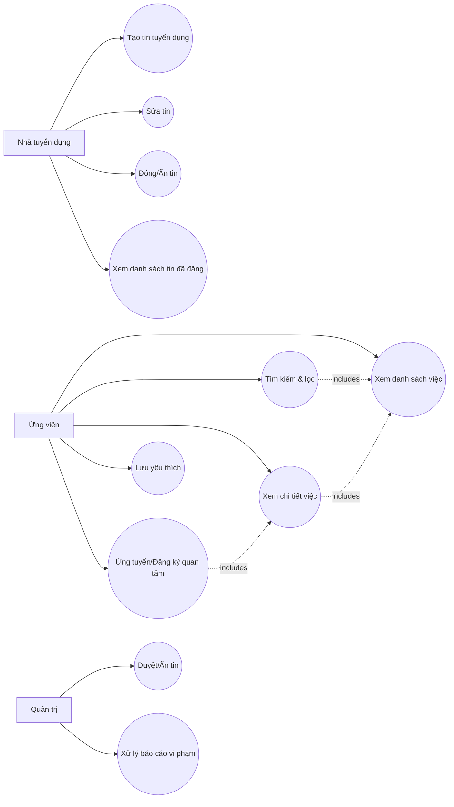

# Use Cases — FindSeasonalJobApp

## 1. Actors
- **Ứng viên (Seeker)**
- **Nhà tuyển dụng (Employer)**
- **Quản trị (Admin)**

## 2. Lược đồ Use Case (Mermaid)

## 3. Đặc tả Use Case (tóm tắt)

### UC-01: Xem danh sách việc
- **Actor:** Ứng viên
- **Mục tiêu:** xem các job mới nhất/đang tuyển
- **Tiền điều kiện:** ứng dụng mở được
- **Luồng chính:**
  1) Hệ thống hiển thị danh sách job
  2) Người dùng cuộn để xem thêm
- **Ngoại lệ:** không có dữ liệu → hiển thị trạng thái rỗng
- **Hậu điều kiện:** không

### UC-02: Tìm kiếm & lọc
- **Actor:** Ứng viên
- **Mục tiêu:** tìm job phù hợp
- **Luồng chính:** nhập từ khoá/chọn lọc → hệ thống cập nhật danh sách

### UC-03: Xem chi tiết việc
- **Actor:** Ứng viên
- **Mục tiêu:** xem mô tả, lương, ca làm, liên hệ
- **Luồng chính:** chọn 1 job từ danh sách → hiển thị chi tiết

### UC-04: Lưu yêu thích
- **Actor:** Ứng viên
- **Mục tiêu:** lưu job để xem lại
- **Luồng chính:** nhấn “Lưu” → job vào danh sách yêu thích

### UC-05: Ứng tuyển/Đăng ký quan tâm
- **Actor:** Ứng viên
- **Mục tiêu:** gửi thông tin liên hệ
- **Luồng chính:**
  1) Ở màn chi tiết, nhấn “Đăng ký”
  2) Nhập họ tên, SĐT, ghi chú
  3) Gửi → hệ thống ghi nhận
- **Ngoại lệ:** thiếu SĐT/họ tên → báo lỗi validate

### UC-06: Tạo tin tuyển dụng
- **Actor:** Nhà tuyển dụng
- **Mục tiêu:** đăng job mới
- **Luồng chính:** nhập thông tin → đăng tin

### UC-07: Sửa tin
- **Actor:** Nhà tuyển dụng
- **Luồng chính:** chọn tin → sửa → lưu

### UC-08: Đóng/Ẩn tin
- **Actor:** Nhà tuyển dụng
- **Luồng chính:** chọn tin → đóng/ẩn

### UC-09: Xem danh sách tin đã đăng
- **Actor:** Nhà tuyển dụng
- **Luồng chính:** mở mục “Tin của tôi” → hiển thị danh sách

### UC-10: Duyệt/Ẩn tin
- **Actor:** Quản trị
- **Luồng chính:** duyệt danh sách tin → approve/ẩn

### UC-11: Xử lý báo cáo vi phạm
- **Actor:** Quản trị
- **Luồng chính:** xem báo cáo → hành động (ẩn tin/cảnh báo/khóa)
